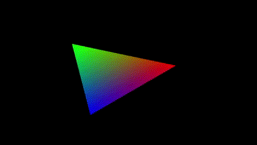
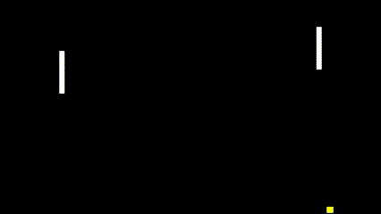

# Eva Programming Language

The experimental basic toy language is inspired by Clox from *Crafting Interpreters*, however, Eva has an AST and SSA representation of the program and types.  
The main purpose of the language is to learn more about how to build them.
The AST and SSA representations are made the way I understand them - they might lack grace 

### Features
- **Constant Folding**: If possible, calculate constant values at compile time
- **Dead Variable Elmination**: Remove unused variables
- **Constant Propagation**: If variable is deduced to be constant, replace all variable usage as constant
- **SSA (Static Single Assignment)**: Represent variables with a single assignment each, using phi-nodes to handle merges at control flow joins
- **Control Flow Graph (CFG)**: Represent program execution paths as a graph
- **C FFI**: Call C functions from GLFW and legacy OpenGL by defining modular bindings that are dynamically loaded into the virtual machine.

## C FFI Demos

| Triangle | Ping-Pong |
|----------|-----------|
|  |  |

## Optimization Examples

### Constant Folding

Original:
```cpp
a := 2;
c0 := 7 + a + 3 + 3;
```

Optimized Bytecode:
```cpp
[0]  CONST_VALUE   2
[2]  SET_GLOBAL_VAR a

[4]  CONST_VALUE   15
[6]  SET_GLOBAL_VAR c0
```

### Constant Propagation

Original:
```cpp
a := 4;
b := a + 3;
c := b + 2;
```

Optimized Bytecode:
```cpp
[0] CONST_VALUE 4
[2] SET_GLOBAL_VAR a

[4] CONST_VALUE 7
[6] SET_GLOBAL_VAR b

[8] CONST_VALUE 9
[10] SET_GLOBAL_VAR c
```

### Dead Code Elimination

Original:
```cpp
fun main() {
    a := 5;
    b := 10;
    c := a + 2; // 'c' is never used
    Print(b);
}
```

Optimized Bytecode:
```cpp
[0] CONST_VALUE 10
[2] GET_NATIVE_NAME Print
[4] GET_LOCAL_VAR 0
[6] CALL
[7] 1
[8] POP
[9] NIL
[10] RETURN
```


